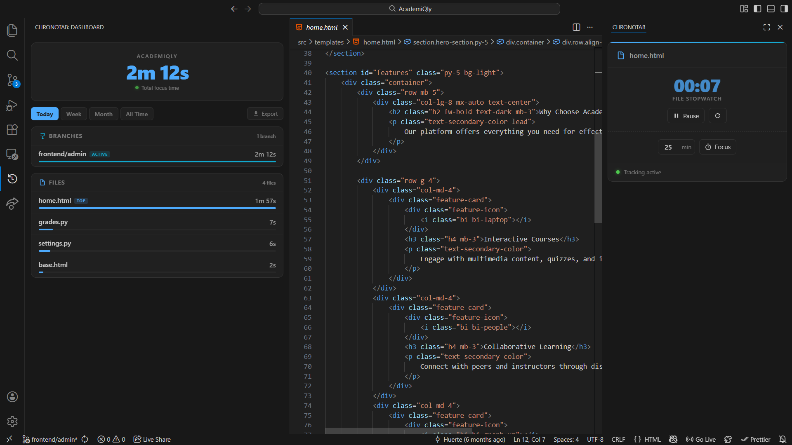

<div align="center">

# ChronoTab

[](#)
[](#)
[](#)

**A dynamic Visual Studio Code extension that accurately tracks how long you actively focus on a specific file tab.**



</div>

---

## Features

ChronoTab provides a dedicated Webview UI panel designed for tracking per-file focus time across Git branches, with a real-time analytics dashboard, Pomodoro timer, idle detection, and CSV export.  
Built to be offline-capable, highly responsive, and non-intrusive.

- **Real-time Analytics:** Tracks exact time spent on individual files and aggregates data by Git branch.
- **Pomodoro Timer:** Included built-in timer for focused work sessions, tightly integrated into the UI.
- **Idle Detection:** Automatically pauses background tracking after a configurable period of inactivity.
- **CSV Export:** Easily export your tracked focus time data for reporting and external analysis.
- **Responsive Layout:** Adapts across vertical and horizontal editor panels using a robust CSS Grid architecture.
- **Asynchronous Updates:** Decouples logic and UI via robust `webview.postMessage` integration to ensure smooth editor performance.
- **Offline Support:** Core features remain functional without internet connectivity.

---

## Installation Guide

Follow these steps to install ChronoTab locally from source, or download the `.vsix` file directly.

### Prerequisites

- **Visual Studio Code** (v1.80.0 or higher)
- **Node.js** (includes npm)
- **Git** (optional, for branch tracking features)

---

### Step 1: Get the Code

```bash
git clone https://github.com/Huerte/ChronoTab.git
cd ChronoTab
```

---

### Step 2: Install Dependencies

```bash
npm install
```

---

### Step 3: Package Extension (If building from source)

To build the extension file, you need the official VS Code Extension Manager (`vsce`):

```bash
npm run compile
npm install -g @vscode/vsce
vsce package --no-dependencies
```
*(If it asks about a missing repository field, type `y` and press Enter).*

You will now see a file named `chronotab-3.0.0.vsix` in your project folder.

---

### Step 4: Install the Extension

Install the generated `.vsix` file directly into your VS Code editor using this command:

```bash
code --install-extension chronotab-3.0.0.vsix
```

---

## Usage

1. Reload your VS Code window (`Ctrl` + `Shift` + `P`, type **Reload Window**, and press Enter).
2. Open your File Explorer sidebar on the left.
3. Look for the new **ChronoTab** panel.
4. Drag and drop this panel into your bottom terminal area, secondary sidebar, or anywhere you prefer!
5. Start tracking your time seamlessly as you work across different file tabs. 

---

## Project Structure

```
ChronoTab/
│
├── src/                # Core extension logic and Webview providers
├── assets/             # Static resources (icons, screenshots)
├── out/                # Compiled output
├── node_modules/       # Dependencies
└── package.json        # Extension manifest and configuration
```

---

## Configuration

Edit the configuration settings in VS Code (`Ctrl` + `,` and search for "ChronoTab"):

- `chronotab.idleTimeoutMinutes`: Minutes of inactivity before ChronoTab automatically pauses background tracking (Default: `5`).
- `chronotab.pomodoroMinutes`: Default duration in minutes for the Pomodoro countdown timer (Default: `25`).
- `chronotab.trackGitBranch`: Group tracked time by the active Git branch name (Default: `true`).

---

## Contributing

Contributions, issues, and feature requests are welcome!

1. Fork the Project  
2. Create a Feature Branch (`git checkout -b feature/AmazingFeature`)  
3. Commit Changes (`git commit -m 'Add some AmazingFeature'`)  
4. Push to the Branch (`git push origin feature/AmazingFeature`)  
5. Open a Pull Request  

---

## License

Distributed under the MIT License. See `LICENSE` for details.

---

&copy; 2026 [Huerte](https://github.com/Huerte). All Rights Reserved.
